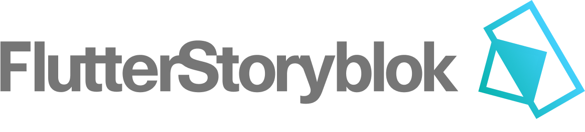

                                        
This Flutter project integrates with Storyblok, a headless CMS, to dynamically
fetch and render content. Follow the instructions below to set up and run the
project.

## Getting Started

1. **Personal Access Token:** Obtain your Personal Access Token from Storyblok.
   You can find it under `My Account` > `Security` > `Personal Access Token`.

2. **Space ID:** Find your Space ID in Storyblok under `Settings` > `General` >
   `Space`.

## Running the Generator
Navigate to the project directory and run the following commands:

```bash
dart run code_generator/bin/flutter_storyblok_code_generator.dart \
  <space_id> \
  <personal_access_token> \
  "example/lib/bloks.generated.dart"
```

## Project Structure
The project utilizes a Dart SDK to fetch Storyblok components. A source
generator is used to create Dart classes that parse these Bloks as JSON. The
generated Bloks can then be utilized by a Flutter app to dynamically generate a
page based on a Storyblok Story.

- `code_generator/`
  > Contains the code generator for generating strongly typed classes for
  > Storyblok Blocks found in the "Block library". It fetches the necessary data
  > with the
  > [Storyblok Management REST API](https://www.storyblok.com/docs/api/management).

  - `lib/fields/`
    > Contains the classes for parsing each field type e.g Text, Single-option,
    > Blocks etc.

- `lib/`
  > Contains the Storyblok SDK Client for fetching stories with the
  > [Storyblok Content Delivery REST API](https://www.storyblok.com/docs/api/content-delivery/v2/).

## API Documentation

Refer to the following Storyblok API documentation for more details:

- [Storyblok Content Delivery API V2 Reference](https://www.storyblok.com/docs/api/content-delivery)
- [Storyblok Management API Reference](https://www.storyblok.com/docs/api/management)

Feel free to explore these resources for a deeper understanding of the
integration and customization options.
